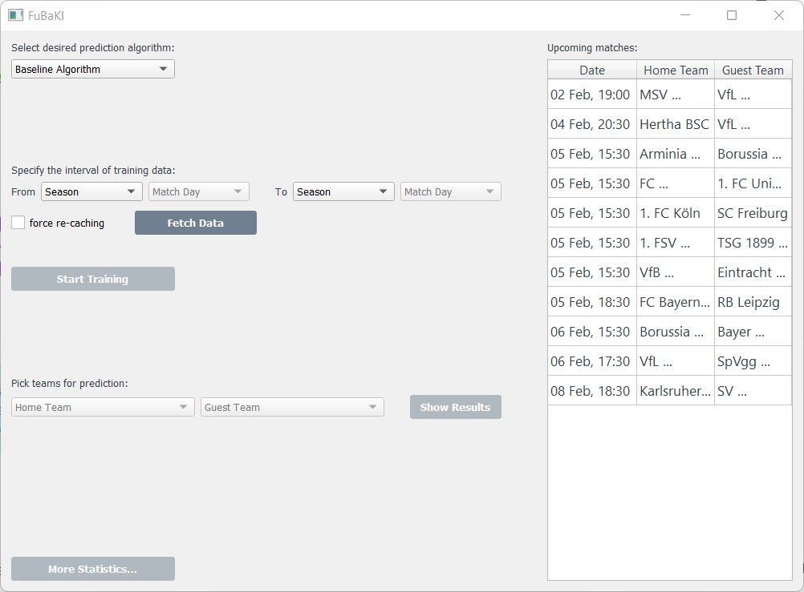

FubaKI
-----------

FubaKI is a Bundesliga prediction program. It allows anyone to predict the results of upcoming matches with machine learning algorithms. FubaKI allows you to first choose the algorithm you want to use, then choose the timeframe you think is most relevant for the algorithm to train with, and as a last step chose the matchup you want to predict. After these 3 simple steps, you have a predicted a winner for that matchup !

Here is an example of our program:

Algorithms
=====

The program allows you to pick between different algorithms to predict the outcome of the chosen game. You can choose between the
Baseline algorithm, Poisson Regression Algorithm and the Dixon Coles Algorithm. Because each of those algorithms has different properties,
the chosen Timeframe for the crawled data can greatly impact the outcome. Because of this reason, here is a suggested timeframe for each of the
Algorithms.

Baseline Algorithm: Previous 8 Days

Poisson Regression: Previous 2 Seasons

Dixon Coles: Largest Possible timeframe

Dependencies
=====

FubaKI supports Python 3.8+.

Installation requires numpy, matplotlib, aiohttp, asyncio, statsmodels, pandas and pyQT5.

Installation
============

1. Clone this repository to your device

2. Install the needed packages via `pip install -e .`, this will install all the needed packages.

3. Execute the `main.py` file via the command `teamproject`.

Data
============

The Data that is used by our Algorithms come from the very large source of https://www.openligadb.de/. Openligadb is a community based Database where anyone with an account
can add matches and add to the database.
